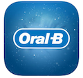
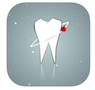

# Requirements Document

### Table of Contents

1. [Introduction](#1)  
	1.1. [Purpose](#1.1)   
	1.2. [Business requirements](#1.2)  
		1.2.1. [Initial data](#1.2.1)  
		1.2.2. [Business opportunities](#1.2.2)  
	1.3. [Analogues](#analogues)  
2. [User Requirements](#2)  
	2.1. [Software Interfaces](#2.1)  
  	2.2. [User Interfaces](#2.2)  
  	2.3. [User Characteristics](#2.3)  
  		2.3.1. [User Classes](#2.3.1)  
  		2.3.2. [Application Audience](#2.3.2) 
  	2.4. [Assumptions and Dependencies](#2.4)  
3. [System Requirements](#3.)  
  	3.1. [Functional Requirements](#3.1)  
  		3.1.1. [Basic functionality](#3.1.1)  
  			3.1.1.1. [User logon to the application](#3.1.1.1) 
  			3.1.1.2. [Access to medical data](#3.1.1.2) 
  			3.1.1.3. [Adding medical information](#3.1.1.3) 
  			3.1.1.4. [Deleting medical information](#3.1.1.4) 
  			3.1.1.5. [Editing basic medical information](#3.1.1.5) 
  		3.1.2. [Limitations and Exceptions]() 
  	3.2. [Non-Functional Requierements](#3.2)  
   		3.2.1. [Software Quality Attributes](#3.2.1)  
    		3.2.1.1. [Usability](#3.2.1.1)  
    		3.2.1.2. [Security](#3.2.1.2)  
    	3.2.2. [External Interfaces](#3.2.2)  
    	3.2.3. [Constraints](#3.2.3)  

## 1\. Introduction 

### 1.1\. Purpose 
This document contains functional and non-functional requirements for the mobile application "tistic.co" for iOS 12 and higher. This document is intended for a team that will implement and verify the correctness of the application.

### 1.2\. Business requirements

#### 1.2.1\. Initial data 
Modern IT technologies are making their way into all areas of human life. Maintaining electronic medical records is especially popular, since it saves patients from excessive bureaucracy with paper-based documents. It is also convenient for doctors, who at any time can get information about the medical history of patient. But not all electronic media have information about the health of the patient's teeth and people must use paper-based documents.

#### 1.2.2\. Business opportunities 
Many people want an application that will allow you to store your health data electronically, with minimal technical literacy. Such application will allow them to spend less time searching for necessary information about their health. This will also allow doctors to spend less time for collecting information about the patient. The designed user interface should allow the application to be used by people with minimal technical knowledge.

### 1.3\. Analogues
Main difference from analogues – storage of medical history and tooth chart in one application.  

- <b>Oral-b by [P&G Productions](https://us.pg.com) </b> 

	Oral-B App is your personal brushing assistant to help you achieve great oral health. Application provide daily control of cleaning time for teeth and represents this information in the form of charts and graphs. 

	- Lack of basic medical information;
	- Lack of tooth charts.  

- <b>XDENT by [CGM Italia](https://www.cgm.com/it/index.it.jsp)</b>  

	XDENT iPhone edition allows you to manage the dental practice with iPhone. Use iPhone to manage everywhere appointments, patients and treatment plans. 
Essential for practice consultants and to optimize the time and cost of secretariat.
	- Professional software for doctors and clinics;
	- Lack of basic medical information;  
	- Lack of tooth charts.  

- <b>iDent by [Chris Balla](https://itunes.apple.com/us/developer/chris-balla/id586697061?mt=8)</b>  
  
	
	Connects laboratory chair-side with real-time consulting for a better Patient acceptance, results and maximum flexibility, Case management allows more efficient scheduling, greatly reducing clinical “down-time”. 
	- Lack of basic medical information;
	- Professional software for doctors and clinics.

## 2\. User Requirements 

### 2.1\. Software Interfaces 
Application uses [HealthKit framework](https://developer.apple.com/healthkit/), that represent your medical data from iOS system application Health.

### 2.2\. User Interfaces 
Graphical user interface is represented by mockup images.

Figure 1. Icon Image of the application 

Figure 2. Startup screen of the application 

Figure 3. Allow access medical data 

Figure 4. Medical data screen 

Figure 5. Dental data screen 

Figure 6. Dental data screen (continuation) 

### 2.3\. User Characteristics 
#### 2.3.1\. User Classes 
| User class | Description |
|:---|:---|
| Registered users | Users who are logged in iOS system using their Apple ID, have access to full functionality of the application|
| Anonymous users | Users who are not logged in iOS system. Don't have access to the functionality of the application|

#### 2.3.2\. Application Audience 
People of middle age category with a basic and higher education level, who have minimal technical literacy.
### 2.4\. Assumptions and Dependencies 
1. The application requires authorization in iOS system;
2. The application requires access rights to health information in the system;
3. The application will work without network conntection.

## 3\. System Requirements 
### 3.1\. Functional Requirements 

#### 3.1.1\. Basic functionality 

##### 3.1.1.1\. User logon to the application 
<b>Description: </b> The user has the opportunity to use the application without creating his / her own profile by logging into his / her account in the iOS system.

Function | Requirements
| :--- | :--- 
User logon | The application should allow the user to log in by receiving information from the iOS system

##### 3.1.1.2\. Access to medical data 
<b>Description: </b> The user has the opportunity to allow / deny application access for collecting medical data from iOS system.

Function | Requirements
| :--- | :---
Access to medical data | The application should allow the user to authorize / prohibit collecting medical information from the iOS system

##### 3.1.1.3\. Adding medical information 
<b>Description: </b> The user has the opportunity to add medical information in the application.

Function | Requirements
| :--- | :---
Adding medical information | The application should allow the user to authorize / prohibit collecting medical information from the iOS system

##### 3.1.1.4\. Deleting medical information 
<b>Description: </b> The user has the opportunity to delete inputed medical information in the application.

Function | Requirements
| :--- | :---
Deleting medical information | The application should allow the user to delete inputed medical information 

##### 3.1.1.5\. Editing basic medical information 
<b>Description: </b> The user has the opportunity to edit basic medical data in the iOS system.

Function | Requirements
| :--- | :---
Editing basic medical information | The application should allow the user to edit medical information in the iOS system

#### 3.1.2\. Limitations and Exceptions 
1. Application works without network connection;
2. Editing basic medical data is provided by opening iOS system application Health.

### 3.2\. Non-Functional Requierements 
#### 3.2.1\. Software Quality Attributes 
##### 3.2.1.1 Usability 
1. All elements must be in bright colors;
2. All functional elements of the user interface have names describing the action that the element does.

##### 3.2.1.2 Security
Application allow to interrupt with medical information after authorization in iOS system using Apple ID.

#### 3.2.2\. External Interfaces 
Application screens should be convenient for use by users with poor eyesight:

- font size not less than 12 pt;
- functional elements are contrast to the screen background.

#### 3.2.3\. Constraints
1. Application is created for iOS 12 system 

