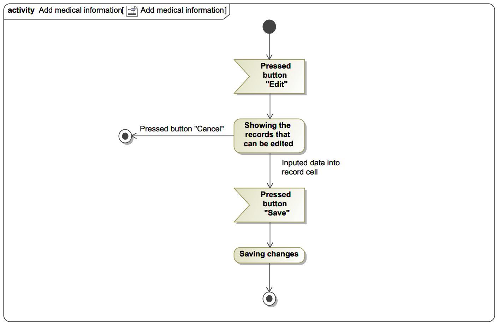
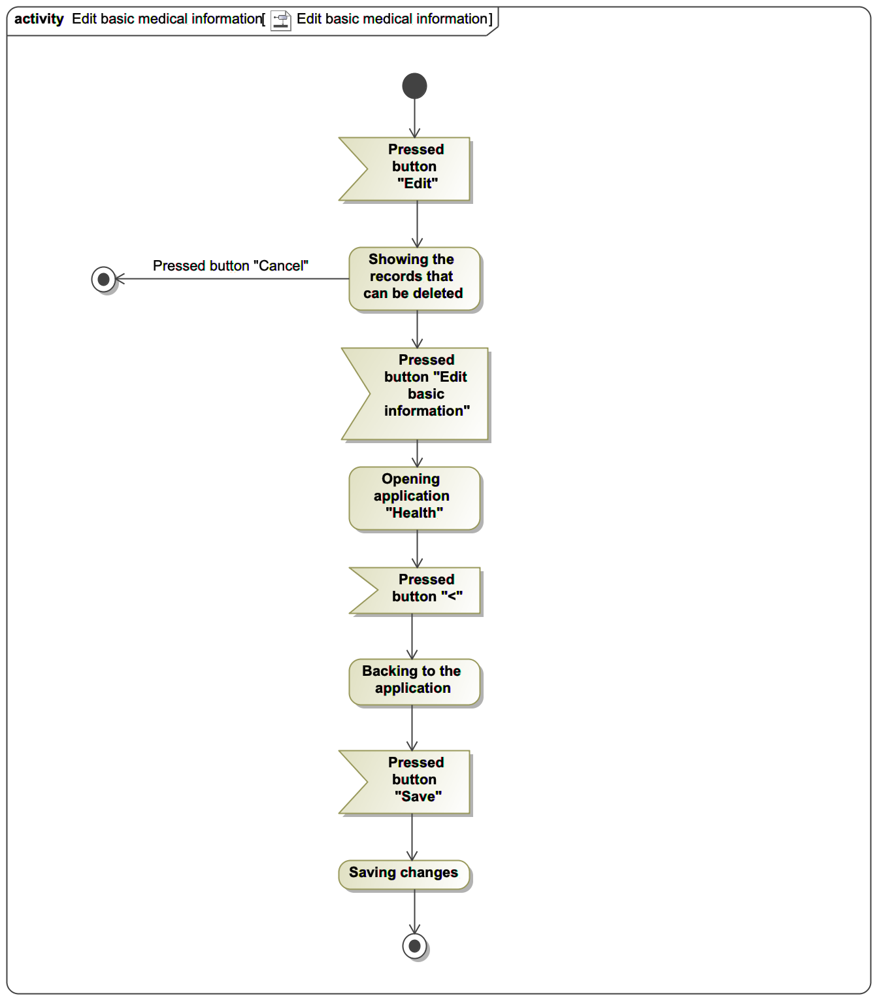
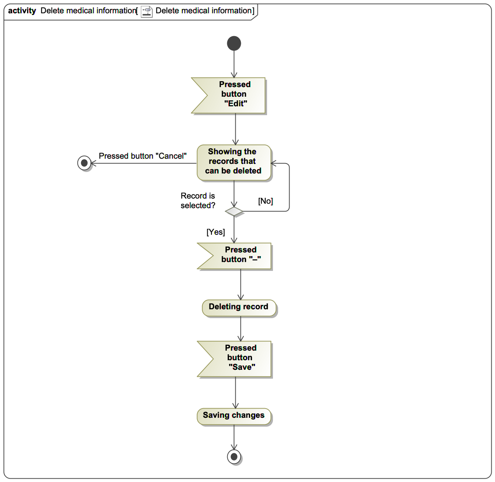

# Activity Diagrams document

## Content
#### 1. [Add medical information](#1)
#### 2. [Edit basic medical information](#2)
#### 3. [Delete medical information](#3)

# 1 Add medical information 
When the user presses button "Edit" application will represent records that can be added or edited. User add information and after that changes needs to be saved by pressing "Save" button. If the user press button "Cancel", the process of adding will be terminated.

# 2 Edit basic medical information 
When the user presses the button "Edit" and than presses button "Edit basic information" application perform opening system application "Health" to change this information in system. When user has finished working with application "Health", needs to press button "<" to back into the application "tistic.co". After that, changes needs to be saved by clicking button "Save". This process can be terminated by clicking "Cancel" button on the step after click "Edit".

# 3 Delete medical information 
When the user presses the button "Edit" application will show all avalible records for deleting. To perform deleting operation, needs to press button "–" near selected record. This action can be terminated by clicking "Cancel" button. After deleting changes needs to be saved by clicking "Save" button.
