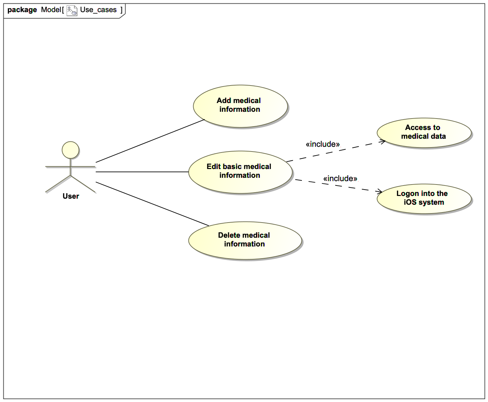

# System design (UML)

#### [Glossary](Glossary.md)

1. [Activity Diagram](#1) 
2. [Use Case Diagram](#2) 
2.1. [Actors](#2.1) 
2.2. [Use Cases](#2.2) 
2.2.1. [User logon](#2.2.1) 
2.2.2. [Access to medical data](#2.2.2) 
2.2.3. [Add medical information](#2.2.3) 
2.2.4. [Delete medical information](#2.2.4) 
2.2.5. [Edit basic medical information](#2.2.5) 
3. [Sequence Diagram](#3) 
4. [State Machine Diagram](#4) 
5. [Class Diagram](#5) 
6. [Component Diagram](#6) 
7. [Deployment Diagram](#7) 

# 1\. Activity Diagram 
Activity Diagram is represented [here](Activity_diagrams/Activity.md)

# 2\. Use Case Diagram  

## 2.1\. Actors  
Actor | Description
| :-- | :--
User | Human that use this application

## 2.2\. Use Cases  
### 2.2.1\. User logon 
<b>Description:</b> Use Case "User logon" allows user to log in iOS system.
<b>Preconditions:</b> User opened the application. 
<b>Flow of events:</b>  
1. Application checks logon in iOS system; 
2. If user is logged in, go to step 4; 
3. Application opens system application "Settings"; 
4. End.  

### 2.2.2\. Access to medical data 

<b>Description:</b> Use case "Access to medical data" allows user to provide access to medical data from iOS system to the application.
<b>Preconditions:</b> User opened the application for the first time. 
<b>Flow of events:</b>  
1. Application shows dialog window and asks for access; 
2. User press button "Don't allow", go to step 4; 
3. Application retrieves medical information from the system; 
4. End. 

### 2.2.3\. Add medical information 

<b>Description:</b> Use case "Add medical information" allows user to add medical data of didseases, allergy, medicaments or teeth. 
<b>Flow of events:</b>  
1. User press button "Edit"; 
2. User select the record's type to add; 
3. User input data; 
4. User press button "Save";  
5. Application save changes;  
6. End. 
### 2.2.4\. Delete medical information 

<b>Description:</b> Use case "Delete medical information" allows user to delete medical data of teeth. 
<b>Flow of events:</b>  
1. User press button "Edit"; 
2. User select the record to delete; 
3. User press button "–" near the selected record; 
4. User press button "Save";  
5. Application save changes;  
6. End. 

### 2.2.5\. Edit basic medical information 
<b>Description:</b> Use case "Edit basic medical information" allows user to edit medical data of basic medical information. 
<b>Flow of events:</b>  
1. User press button "Edit"; 
2. User select block of basic medical information; 
3. User press button "Edit basic information" near the selected record; 
5. Application opens system aplication "Health";  
6. User edit basic information and comes back to the application; 
7. Application save changes;  
8. End. 

# 3\. Sequence Diagram 

The sequence diagram of the main use case:

# 4\. State Machine Diagram

# 5\. Class Diagram 

# 6\. Component Diagram 

# 7\. Deployment Diagram 